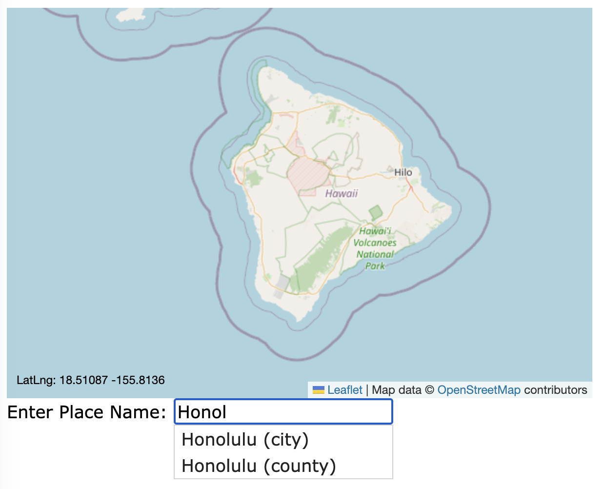

[](https://classroom.github.com/open-in-codespaces?assignment_repo_id=10957574)
# Assignment: Custom Python FastAPI Geospatial App

The objective of this assignment is to build a web application that allows a user to browse a map and search for the closest coffee shops and gas stations. You will use the following technologies:
- Python FastAPI (web application framework)
- PostGIS (geospatial database)
- Leaflet (javascript library)

You will start by adding a simple serarch feature that fetches places from your `osm` database and prints them on a new page. You will then adapt the page to returning geospatial results asynchronously, build an auto-complete feature, and finally provide routing recommendations as part of a real-time dynamic geospatial application

## Housekeeping
To start with, we need to start up a database and import OSM data from geofabrik.de:
```
docker compose up -d
./populate_database.sh
```

## Background
### Python FastAPI
[FastAPI](https://fastapi.tiangolo.com/) is a fast web application framework written in python. It provides an easy and organized way to build dynamic websites. Read the [FastAPI Example](https://fastapi.tiangolo.com/#example) to get a feel for how it works. In this assignment the basic structure of a working FastAPI application is provided for you so all you need to do is expand in a few places to turn it into a geospatial processing application.

### AJAX and JQuery
In the early days of the web, webpages were generally loaded all at once and rendered one time. This was extremely limiting for interactive applications because every action required loading a whole new page. Javascript provides the interactivity needed to reload parts of the page by changing the document object model or loading content into memory. AJAX (an acronym of the poorly named "Asynchronous JavaScript And XML") allows javascript to send http requests using `XMLHttpRequest` in order to dynamically update an HTML document. There are various ways to use AJAX but the simplest is to use a an AJAX library like JQuery. 

[JQuery](https://jquery.com/) is a javascript library that allows you to update the HTML document based on the results of calls to remote urls. Read https://learn.jquery.com/about-jquery/how-jquery-works/ to understand more about what JQuery is and how it works.

## Assignment

Initially, this repo will have a working FastAPI application that serves an interactive map running in [static/index.html](static/index.html). The page will have a search box in which you can search for place names. Initially, this search will do nothing. It is your job to wire it up to query the OSM database you populated and search for placenames. 

The first objective for the student will be to add a search feature. This search feature will allow you to enter a place name and it will search the PostGIS database for matching results. To accomplish this the student will have to make two things:

- Add a form to the index.html page
- Create a `/search` route in the FastAPI app that searches the database

### Create a `/search` route in FastAPI

At first we are going to make the `/search` endpoint populate results in an HTML page named `results.json`. Then, once we can see that it's working, we will wire it up to auto-complete using AJAX. 

Add the following API endpoint to your `main.py`.
Note that it uses the http GET interface:
```
@app.get("/search/{place}")
async def search(place: str):
    
    # This is the actual query. You may want to work out the SQL statement in a separate `psql` or other datbase session.
    # The start SQL will give you everything matching `place` exactly which isn't quite what you need. 
    # See the instructions for guidance on how to update this for this jquery autocomplete
    query = '''
SELECT 
  name as label, 
  name
FROM 
  import.osm_places 
WHERE 
  name = :name
'''
    rows = await database.fetch_all(query=query, values={"name": place})
    # For our pursposes we want to save the results in a special json format with two keys: `label` and `value`.
    # That's because jquery `autocomplete` will work if follow this format convention for our JSON output.
    
    results = []
    for row in rows:
        results.append({'label': row[0], 'value': row[1]})
    return results
```

The way this query is written it is making an EXACT string match. For example, if you search for "Honolulu" you will get two  results. Try it on the command line:

```
curl localhost:8000/search?q=Honolulu
```
It might be hard to read but there should be two records. This would not return "East Honolulu", however. It's also case sensitive so this will return nothing:
```
curl localhost:8000/search?q=honolulu
```
What we really want is to be able to return partial matches. For example:
- "hon" -> All the Honolulus, including East Honolulu PLUS anything with "hon" in its name, such as "Piʻihonua".


If you need a hint for how to add the `%` wildcard to your search term:
```
    # This adds a `%` to the end of the `place` parameter, changing, e.g. "Hono" to "Hono%".
    place = "{}{}".format(place,'%')
```    
If you want to ignore case, cast both terms to upper case using the postgresql `upper()` and the python `.upper()` function.

### Tweak the SQL query

Open your PostgreSQL Explorer and work out the correct SQL to produce the following.  Your goal is to produce a SQL query that outputs results like the following, given a term like `honol`:

| Label             | Value      | 
| ----------------- | ---------- |
| Honolulu (city)   | 21442033   |
| Honolulu (county) | 3962058199 |

Once you get the SQL figured out, embed the SQL in your `/search` FastAPI route (being sure to escape any single quotes). To test it out in a terminal window:
```
curl http://localhost:8000/search?q=honol
```
The `json` will be squished but you can make it more readable by piping it through a utility named `jq`:
```
curl http://localhost:8000/search?q=honol | jq '.'
```

When it works the results will look like this:
```
[
  {
    "label": "Honolulu (city)",
    "value": 21442033
  },
  {
    "label": "Honolulu (county)",
    "value": 3962058199
  },
  {
    "label": "East Honolulu",
    "value": "East Honolulu"
  }
]
```

At this point you are ready to wire up autocompletion from the javascript side.

#### Deliverable: `/search` screenshot
Once your `/search` is working, take a screenshot of the output of the curl command above and name it:
- `screencap-search.png`

### Setup JQuery with autocomplete
Open your `index.html` page. 

To enable the use of the JQuery javascript library, add the following to the `<head>` section:
```
    <!-- jQuery library -->
    <script src="https://ajax.googleapis.com/ajax/libs/jquery/3.6.0/jquery.min.js"></script>

    <!-- jQuery UI library -->
    <link rel="stylesheet" href="https://ajax.googleapis.com/ajax/libs/jqueryui/1.13.2/themes/smoothness/jquery-ui.css">
    <script src="https://ajax.googleapis.com/ajax/libs/jqueryui/1.13.2/jquery-ui.min.js"></script>
```
Next, to setup autocomplate, add this autocomplete script to the `<head>` section (replacing the section with `// our logic goes here`):
```
         <script>
          $( function() {
              $( "#place" ).autocomplete({
                source: function( request, response ) {
                  $.ajax({
                    url: "/search",
                    dataType: "json",
                    data: {
                        q: request.term
                    },
                    success: function( data ) {
                      response($.map(data, function(item) {
                        return {
                            label : item.label,
                            value : item.value
                        };
                      }));
                    }
                  });
                },
              });
          } );
        </script>
```

`uvicorn` will reload the app and you can refresh the page in your browser to see changes. 

When autocomplete works you should be able to type "Honol" and see the autocompletion dialog show up below the text box:




#### Deliverable: `/search` result screenshot
Once your autocomplete `/search` is working, take a screenshot of the output of the index.html page with the autocomplete drop-down
- `screencap-result.png`. Use something other than the "Honolulu" search in the example above, though. 

### Make the autocomplete clickable
The HTML page with javascript is located at [static/index.html](static/index.html). We want the autocomplete results to be clickable so that when you click on a result it adds a Leaflet marker on the map and zooms the map to it. Look for the comment `setup places search autocomplete` to find where we are going to setup the autocomplete.

The way we are going to do this is to bind an action, `select` to a function we will write that will add the marker. The documentation for this action is here in the [JQuery docs](https://api.jqueryui.com/autocomplete/#event-select). Look over the following function and try to make sense of it. 


```
  select: function( event, ui ) {
      event.preventDefault();

        var lat = ui.item.lat; // todo: this needs to be part of the `/search` response
        var lon = ui.item.lon; // todo: this needs to be part of the `/search` response

        // if the marker is not null it means we already have one that should be removed before we add another one
        if (marker != null) {
          map.removeLayer(marker)
        }
        marker = L.marker([lat, lon],{title: ui.item.label, icon: redIcon}).addTo(map);
        
        marker.bindPopup('<b>'+ui.item.label+'</b>').openPopup();

        // Add a button to find coffee. This button should be bound with an `onclick` action that calls a
        // javascript `findCoffee()` function that takes a longitude and latitude argument
        $( "#search") .html('<input type="button" value="Find coffee!" onclick="findCoffee('+marker.getLatLng().lng+','+marker.getLatLng().lat+')">');

        map.flyTo([lat, lon], 14);

        return false;
  }
```
Note that the above requires a few things ro work:
- the `/search` result must return additional information beside the `label` and `name`. 
  - Specifically, it needs to return two arguments named `lon` and `lat`. You will need to modify the SQL to return two additional columns. You will want to look into the PostGIS functions [`ST_X()`](https://postgis.net/docs/ST_X.html) and [`ST_Y()`](https://postgis.net/docs/ST_Y.html). 
- Note also that the default projection for your OSM data is `EPSG:3857` which is _not_ lat/long so you will need to use the [`ST_Transform()`](https://postgis.net/docs/ST_Transform.html) function as well. The SRID you want is `4326`.
- This also requires a `findCoffee()` javascript function that takes two numbers for longitude and latitude. Initially, this function doesn't do anything except pop-up a dialog with the lat, long coordinates.

I suggest you use your postgresql query browser to work out the syntax for the SQL query. 

Additionally, as you tweak the files, VS Code will auto save them and reload the app. You can quickly test with your `curl` command:
```
curl http://localhost:8000/search?q=honolulu | jq '.'
```
And when it works you will get results with lat and long:
```
[
  {
    "label": "Honolulu",
    "value": "Honolulu",
    "lon": -157.85567608140175,
    "lat": 21.304546949388495
  },
  {
    "label": "Honolulu",
    "value": "Honolulu",
    "lon": -157.96051105896382,
    "lat": 21.46815097049943
  },
  {
    "label": "East Honolulu",
    "value": "East Honolulu",
    "lon": -157.71739152666413,
    "lat": 21.289130869252727
  }
]
```

When you do get the clickable autocomplete working you should be able to click on a result and have the map fly to a new red marker for that location. 

#### Deliverable: `/search` marker screenshot
Once your `/search` is working, take a screenshot of the map showing the marker placed when you clicked the search result:
- `screencap-marker.png`

### Create a `/find_coffee` route in your web app
Once you can zoom to a search result we want to add a new API endpoint that allows you to search for cafes near a given latitude, longitude. The cafes are stored in a table named `amenities`. We will create a new route called `/find_coffee` that finds the 5 closest `amenities` records to the location provided (i.e., the geo-location of the place you find from `/search` result). 

The PostGIS is based on [this k-nearest neighbors example](https://postgis.net/workshops/postgis-intro/knn.html). However, instead of using a static point with WKT we will create a new point from the search result's `lon` and `lat`:
```
@app.post("/find_coffee")
async def find_coffee(lon: str, lat: str):
    query = '''
SELECT 
  a.geometry <-> ST_Transform(ST_Point({},{},4326),3857) AS dist, 
  osm_id, 
  name,
  ST_Y(ST_Transform(ST_Centroid(a.geometry), 4326)) AS lat,
  ST_X(ST_Transform(ST_Centroid(a.geometry), 4326)) AS lon
FROM
  import.osm_amenities a
WHERE
  type='cafe'
ORDER BY
  dist
LIMIT 5;
'''.format(lon, lat)
    print(query)
    
    rows = await database.fetch_all(query=query)

    results = []
    for row in rows:
        results.append({'dist': row[0], 'osm_id': row[1], 'name': row[2], 'lat': row[3], 'lon': row[4]})
    # template = jinja2.Template("""{{ matches | tojson(indent=2) }}""")
    # return template.render(matches=results)
    return results
```
This query has two interesting geo parts. There's the `a.geometry <-> ST_Transform(ST_Point({},{},4326),3857) AS dist` and the `ST_Y(ST_Transform(ST_Centroid(a.geometry), 4326)) AS lat,` and `... AS lon` parts.

`<->` gives a distance so we are calculating the distance from the amenity (`a.geometry`) to much more complicated `ST_Transform(ST_Point({},{},4326),3857)`. This is a nest of functions so let's deconstruct from the center out:
```
ST_Point({},{},4326)
```
[`ST_Point`](https://postgis.net/docs/ST_Point.html) simple creates a PostGIS Point geometry from an `x` and `y` value. `4326` is the SRID this geometry will be given. 
```
ST_Transform(ST_Point({},{},4326),3857)
```
In order to compare the `amenties.geometry` field (which is in EPSG:3857, we need to reproject one of them with [ST_Transform](https://postgis.net/docs/ST_Transform.html) PostGIS function. Since distance is better at the equator as a geometry in EPSG:3857, we will project the point to 3857 )

The additional geometry parts are for extracting latitude and longitude values for the coffee shops so that we can display them in the map:

```
  ST_Y(ST_Transform(ST_Centroid(a.geometry), 4326)) AS lat,
  ST_X(ST_Transform(ST_Centroid(a.geometry), 4326)) AS lon,
```
Center out: 
```
ST_Centroid(a.geometry)
```
Since the amenities are polygons, we need an interior point to get a single lat/long value so we use [ST_Centroid](https://postgis.net/docs/ST_Centroid.html).
```
ST_Transform(ST_Centroid(a.geometry), 4326)
```
As above, [ST_Transform](https://postgis.net/docs/ST_Transform.html) reprojects them from their native EPSG:3857 to EPSG:4326 (lat/long). Finally, [`ST_X`](https://postgis.net/docs/ST_X.html) and [`ST_Y`](https://postgis.net/docs/ST_Y.html) simply return the x and y values from a point. 


To test it out, enter this in your terminal:

```
curl -XPOST http://localhost:8000/find_coffee?lat=21.4&lon=-157.7 | jq '.'
```

That route ensures that calls to `http://localhost:5000/find_coffee?lon=-157.9&lat=21.3` (or similar) will return a response like this:
```
[
  {
    "dist": 552.943677956968,
    "lat": 21.3026504599764,
    "lon": -157.860207002981,
    "name": "NIO Snow Ice \u0026 Tea",
    "osm_id": 7675621188
  },
  {
    "dist": 590.892286578368,
    "lat": 21.3006833949397,
    "lon": -157.858989531545,
    "name": "Up Roll Caf\u00e9 Honolulu",
    "osm_id": 5010476325
  },
  {
    "dist": 710.589057675542,
    "lat": 21.298639886946,
    "lon": -157.856416706366,
    "name": "Cafe Villamor",
    "osm_id": 9828508517
  },
  {
    "dist": 763.631317846278,
    "lat": 21.307929131138,
    "lon": -157.861496558784,
    "name": "Cafe Central",
    "osm_id": 2903614201
  },
  {
    "dist": 807.540902546282,
    "lat": 21.2983416588311,
    "lon": -157.852801256251,
    "name": "Mr. Tea",
    "osm_id": 10764748472
  }
]
```

#### Deliverable: `/find_coffee` curl screenshot
Once your `/find_coffee` is working, take a screenshot of the curl command showing the output of 
```
curl http://localhost:5000/find_coffee?lon=-157.9&lat=21.3 | jq '.'
```
Name it: 
- `screencap-find-coffee.png`

Our next task will be to update `index.html` to use the information in this response to add new markers to the map containing the closest cafes to our search location.

### Add closest cafes
In `index.html` there is a stubbed function for `find_coffee()`. Update its content to looks like this:
```
  // search for coffee shops near a point
  function findCoffee(lon, lat) {
    $.ajax({url: "/find_coffee?lon="+lon+"&lat="+lat, success: function(result){
      clearResults();
      let i = 0;
      jsonResult = JSON.parse(result)
      while (i < jsonResult.length) {
        marker = L.marker([jsonResult[i]["lat"], jsonResult[i]["lon"]], {title: jsonResult[i]["name"]}).addTo(map);
        coffeeMarkers.push(marker);
        marker.bindPopup('<i>'+jsonResult[i]["name"]+'</i>').openPopup();
        i++;
      }
    }});
    $ ( "#hide_results" ).show();
  }
```

This function, which is called when the user clicks on the `find coffee` button, will call out to the `/find_coffee` API endpoint and, with a successful result (containing the closest cafes), iterate over each of the records in the result and add a marker to the page. Note however that markers would be added every time we run this function so a call to `clearResults()` (which removes all the markers) preceeds adding markers to the table. This is what `clearResults()` looks like:

```
  // remove coffee shops from map
  function clearResults() {
    while (coffeeMarkers.length > 0) {            
      map.removeLayer(coffeeMarkers.pop())
      $ ( "#hide_results" ).hide();
    }
  }
```


#### Deliverable: `/find_coffee` map screenshot
Once your `/find_coffee` is working on the map, take a screenshot of the map with cafe markers on it
- `screencap-find-coffee-map.png`

We're almost done. We want to allow the user to move the search location in case the marker isn't exactly where we want.

### Make the search result draggable
Make the search result marker draggable in the `#place` autocomplete section by adding `draggable: true` to this line:
```
  marker = L.marker([lat, lon],{title: ui.item.label, icon: redIcon}).addTo(map);
```                  
like this:
```
  marker = L.marker([lat, lon],{title: ui.item.label, draggable: true, icon: redIcon}).addTo(map);
```
Addtionally, we want the `findCoffee()` function to be called with different coordinates if we move the marker so we can update that button on the `dragend` event for that marker:
```
  marker.on('dragend', function(event){
    var marker = event.target;
    var position = marker.getLatLng();
    marker.setLatLng(new L.LatLng(position.lat, position.lng),{draggable:'true'});
    map.panTo(new L.LatLng(position.lat, position.lng))
    $( "#search") .html('<input type="button" value="Find coffee!" onclick="findCoffee('+marker.getLatLng().lng+','+marker.getLatLng().lat+')">');
  });
```

#### Deliverable: `/find_coffee` draggable marker 
Once your `/find_coffee` is working on the map, take a screenshot of the map with cafe markers on it after searching a second time but after dragging the original (red) place marker to another location
- `screencap-find-coffee-dragged.png`

## Conclusion
By this time you should have a python flask web application with three endpoints: `/index`, `/search`, and `/find_coffee` that provide back-end spport for a `static/index.html` page that embeds a map. The page has a testbox that allows a user to search the OSM database for places matching a name and the results are clickable, making it a simple click to search for the closest cafes to the place just searched. Along the way you should have made the following screenshots:
- `screencap-search.png`
- `screencap-result.png`
- `screencap-marker.png`
- `screencap-find-coffee.png`
- `screencap-find-coffee-map.png`
- `screencap-find-coffee-dragged.png`